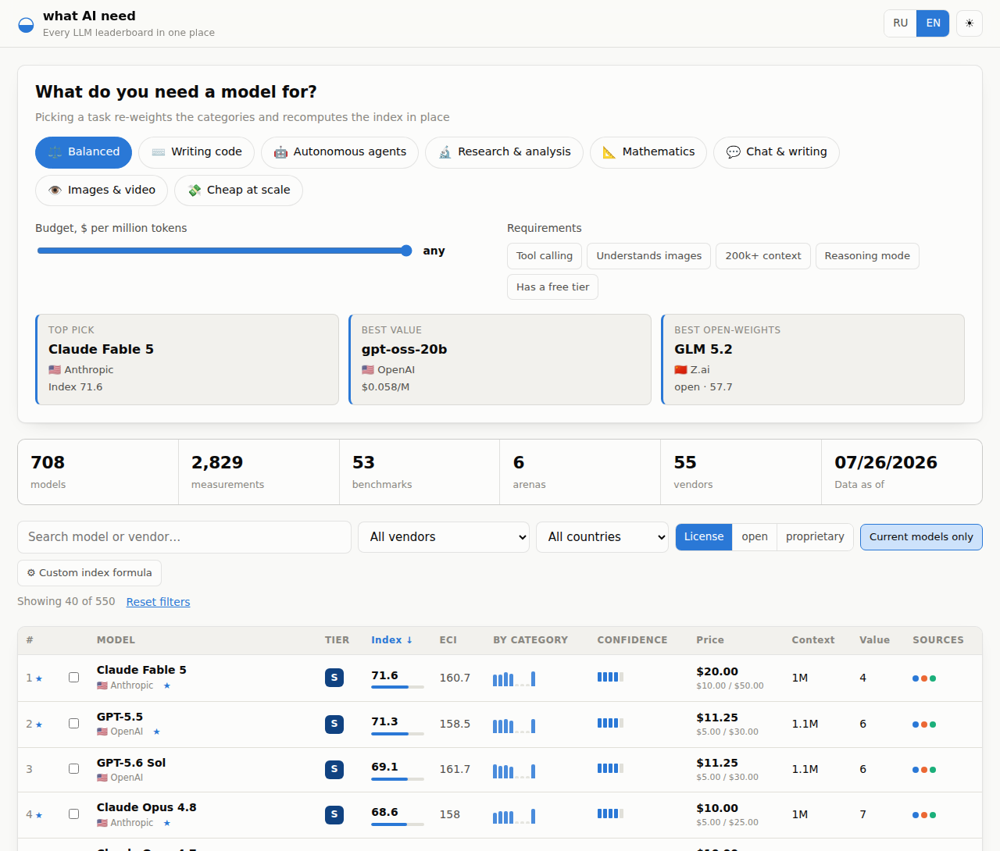
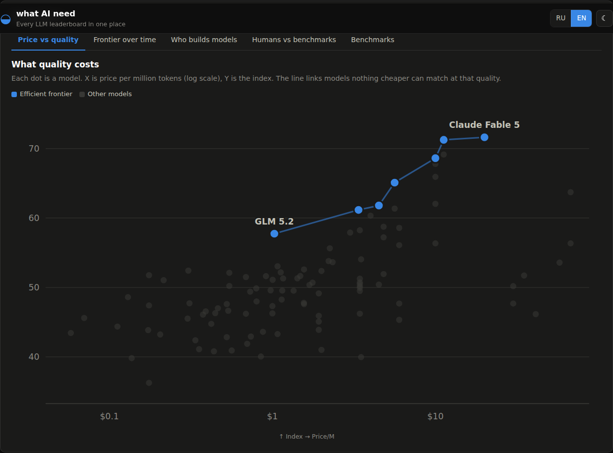

<div align="center">

# what AI need

### Every LLM leaderboard, on one scale, weighted by what *you* actually need

**[what-ai-need.bossincrypto.dev](https://what-ai-need.bossincrypto.dev)**

[](https://github.com/BOSSincrypto/what-ai-need/actions/workflows/deploy.yml)
[](LICENSE)
[](https://what-ai-need.bossincrypto.dev)
[](https://epoch.ai/benchmarks)
[](#performance)
[](package.json)



</div>

---

## The problem

There are dozens of LLM leaderboards and no way to read them together.

GPQA reports a fraction. Arena reports Elo near 1500. Vending-Bench reports
dollars, and its range runs from −31 to +10,940. One board says Claude wins,
the next says GPT, a third ranks by tokens routed. None of them know whether
you are writing code, running agents, or trying to spend under a cent per
million tokens.

So people pick a model from whichever chart they saw last.

## What this does

Pulls **53 benchmarks**, **6 human-preference arenas** and **live pricing** into
one comparable index — then lets you re-weight it for the job you actually have.

```
708 models · 2,829 measurements · 305 priced · 3 independent sources
```

**Tell it what you need.** Eight task presets — coding, autonomous agents,
research, maths, chat, images, cheap-at-scale — each re-weights the categories
and re-ranks all 708 models instantly, in your browser. Or move the sliders
yourself.

**It tells you how much to trust the answer.** A model measured once does not
outrank one measured thirty times. Every score carries a confidence, and the
index is shrunk toward the median in proportion to how thin the evidence is.

**See what quality costs.** The price/quality frontier shows which models
nothing cheaper can match — and which you are simply overpaying for.

<div align="center">

</div>

**And a few things other boards don't show you:**

- 📈 **Frontier over time** — the exact moment each capability ceiling moved, and who moved it
- 🌍 **Who builds models** — the US/China race, by median index rather than headline count
- 🎭 **Humans vs benchmarks** — where blind human votes disagree with test scores, and by how much
- 🔬 **Raw benchmark explorer** — every leaderboard unnormalised, if you distrust the maths
- ⚖️ **Side-by-side** — up to four models across all eight categories

Filter by vendor, country, open weights, price cap, context length, tool
calling, vision, reasoning mode or free tier. Every view is a shareable URL.
Russian and English. Light and dark.

## How the index works

Four steps. All of them are in [`scripts/`](scripts/), and steps 2–4 run again
in your browser every time you touch a weight.

**1 · Normalise.** Each benchmark is stretched to 0–100 against its own cohort
of current models, clamped at the 2nd and 98th percentile. This is what makes a
0–1 fraction, an Elo rating and an unbounded dollar score comparable at all.

**2 · Roll up.** Normalised results are weighted into eight capability
categories: reasoning, maths, coding, agentic, multimodal, long context,
writing, human preference.

**3 · Adjust for evidence.** Confidence is the geometric mean of *breadth* (how
much of the weighted category space is covered) and *depth* (total
measurements). Neither can compensate for the other — 100% breadth with one
datapoint each is still thin. The index is pulled toward the median in
proportion to what's missing.

> Without this step, a model with two arena rows outranked one with
> thirty-three measurements across five categories. It also means a
> brand-new release starts out looking modest — which is honest. There
> genuinely is less evidence about it.

**4 · Re-weight.** Presets and sliders rerun steps 2–4 client-side from the
identical formula. No server, no round-trip.

Epoch's own composite (ECI) sits in its own column rather than being folded in.
It draws on the same underlying runs, so including it would double-count — but
it makes a useful second opinion, and you can sort by it.

### The hard part: nobody agrees what a model is called

The same model arrives as `claude-opus-5_max` from Epoch,
`claude-opus-4-6-thinking` from LMArena, and `anthropic/claude-opus-4.8` from
OpenRouter.

Resolution anchors on OpenRouter's catalogue — the only source listing products
you can actually buy — and matches foreign names by progressively stripping
reasoning-effort, release-channel and build suffixes until something lands.
Order matters: `qwen3.7-max` hits on the first try and keeps its `max` (a
product tier), while `gpt-5.5-high` misses, drops `high`, and correctly
resolves to `gpt-5.5`.

Folding `.` into `-` is what makes it work at all. Without it,
`claude-opus-4.8` (a price, no scores) and `claude-opus-4-8` (34 measurements,
no price) stay two different models forever.

## Data sources

| Source | Provides | Licence |
|---|---|---|
| [Epoch AI Benchmarking Hub](https://epoch.ai/benchmarks) | 53 benchmarks + the Epoch Capabilities Index | CC BY 4.0 |
| [LMArena](https://arena.ai/leaderboard/text) via the [official HF dataset](https://huggingface.co/datasets/lmarena-ai/leaderboard-dataset) | Blind pairwise human votes as Elo, 6 arenas | CC BY 4.0 |
| [OpenRouter](https://openrouter.ai/models) | Pricing, context windows, modalities, capabilities | Public API |

A source only earns a place here if its terms allow republishing what it
provides. Artificial Analysis was evaluated and left out for exactly that
reason: its free Data API tier is *"internal use only; no redistribution"*, and
this site is public. The three above cover every part of the index on their own.

### What this cannot tell you

Benchmarks do not measure tone, production reliability, API quality, rate limits
or speed. Different tests run with different scaffolds and reasoning settings,
so any cross-test comparison is approximate. Prices are OpenRouter's and may
differ from a direct vendor contract. Open weights does not mean free — count
the hardware.

## Performance

No framework. No charting library. Charts are hand-drawn SVG.

| | gzipped |
|---|---|
| JavaScript | **16.3 KB** |
| CSS | 4.3 KB |
| HTML | 1.1 KB |
| Data (meta + models) | 40 KB |
| **First load** | **≈ 61 KB** |

Per-model score breakdowns live in a second payload fetched when the browser
goes idle — that split alone cut first load by 23 KB. Everything is computed at
build time, so the browser only ever filters and sorts arrays it already holds:
no API calls, no CORS, and nothing breaks when an upstream source has a bad day.

## Local development

```bash
npm install
npm run collect     # fetch + normalise all three sources (~10 s)
npm run dev
```

`public/data/` is generated, not committed.

| Command | Does |
|---|---|
| `npm run collect` | Rebuild the data layer from upstream |
| `npm run collect -- --offline` | Rebuild from `.cache/` — no network, instant |
| `npm run typecheck` | `tsc --noEmit` |
| `npm run build` | Production bundle into `dist/` |

**Adding a benchmark is one row** in [`scripts/registry.mjs`](scripts/registry.mjs):
its id, its CSV column, a category and a weight. Nothing else changes — it
appears in the index, the explorer and the model sheets automatically.

## Deployment

GitHub Actions builds and publishes to GitHub Pages on every push to `main`,
**weekly on Monday at 05:25 UTC**, and on manual dispatch. Pull requests run the
same build without deploying. The custom domain comes from `public/CNAME`.

The collector caches every upstream response and falls back to the last good
copy on failure, and CI restores that cache between runs — a source outage
degrades one panel instead of publishing a leaderboard with a hole in it.

First-time setup on a fresh fork:

1. **Settings → Pages → Build and deployment → Source: GitHub Actions.**
2. Point DNS at GitHub Pages — a `CNAME` record for the subdomain to
   `<owner>.github.io.`

No secrets or API keys are required. Every source is public.

## Licence

Code is MIT. Aggregated data belongs to the sources above and stays under their
terms — CC BY 4.0 for Epoch AI and LMArena, which requires attribution when you
reuse it.

<div align="center">
<sub>Built because "which model should I use?" deserved a better answer than a screenshot of one chart.</sub>
</div>
